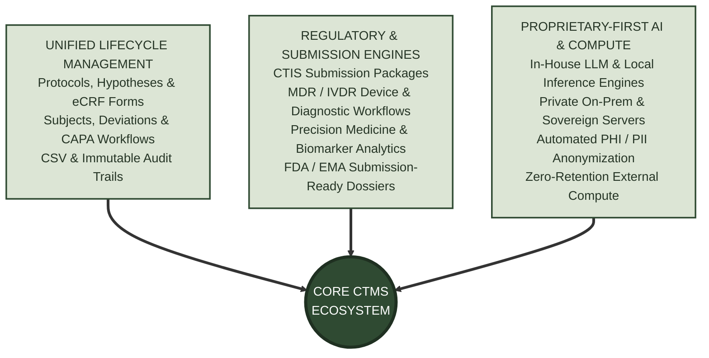
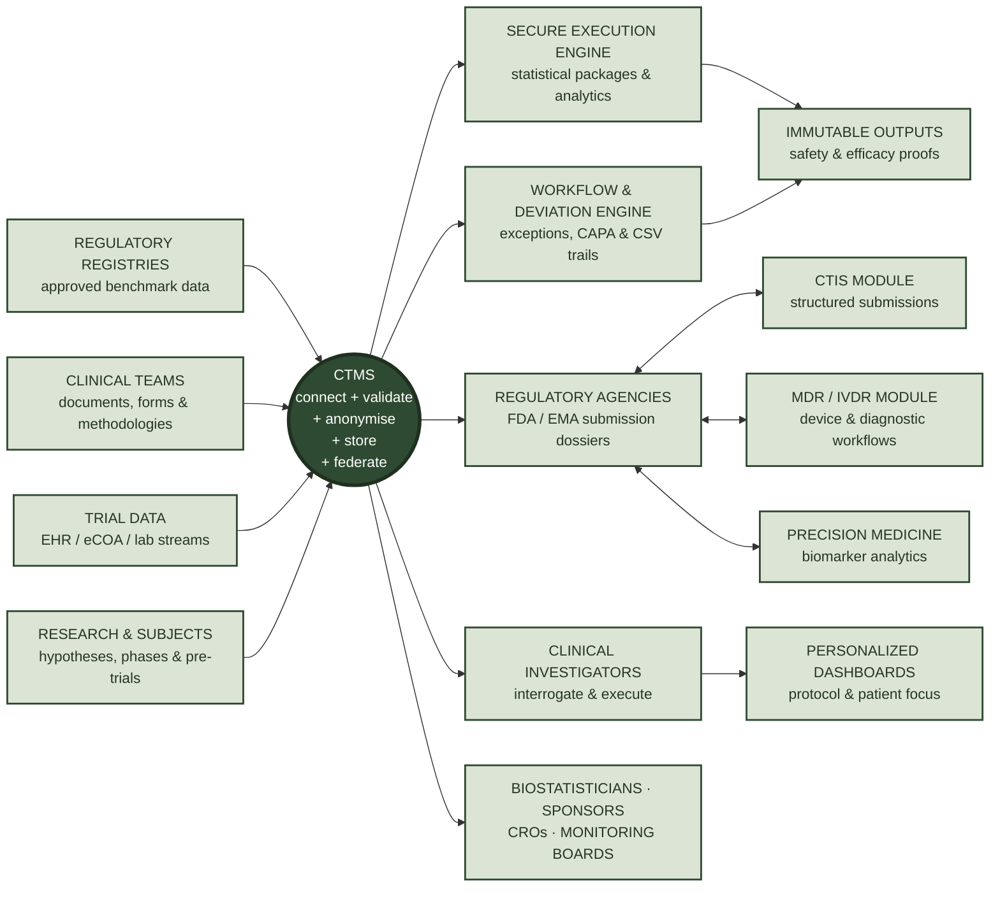
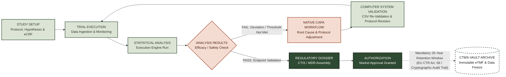

# Clinical Trial Management Platform (CTMS)

**The regulatory-ready execution engine for clinical discovery — unifying multi-source trial data, institutional knowledge bases, and audit-proof analytics into submission-ready evidence.**

The platform is a **fully self-contained, closed-loop clinical execution ecosystem**. From pre-trial hypothesis design to post-study regulatory filing, clinical teams never need to leave the tool. Everything—document registration, subject tracking, phase management, protocol deviations, CAPA workflows, and continuous Computer System Validation (CSV)—is managed natively in a single, unified environment.

## Security & Proprietary-First AI Infrastructure

The platform prioritizes data sovereignty and intellectual property protection through a **proprietary-first AI execution architecture**. Advances in local language models and domain-specific ML engineering allow sensitive clinical workflows to execute entirely within institutional boundaries:

- **Local-First Model Execution:** Standard inference, protocol parsing, eCRF intelligence, and clinical query processing run locally on proprietary servers or isolated private cloud instances without leaking data to third-party endpoints.
- **Zero-Data-Retention External Compute:** When massive scale or specialized external compute is explicitly required, built-in anonymization engines automatically redact PHI/PII and structural trial identifiers before transmitting payloads.
- **Air-Gapped Core Option:** Deployment models allow complete isolation within institutional firewalls, ensuring zero external model dependencies and full compliance with sovereign research data laws.

## Data protection & regulatory compliance

The platform enforces strict data governance protocols and provides targeted regulatory submission workflows to satisfy worldwide mandates:

- **21 CFR Part 11 & EU Annex 11:** Full electronic record traceability, cryptographic audit trails, and strict signature controls preventing harmful modification of analysis outputs.
- **HIPAA & GDPR:** Automated de-identification pipelines separating Protected Health Information (PHI) from trial datasets, with decrypt-on-demand restricted to authorized roles.
- **ICH-GCP & ISO 27001:** End-to-end data integrity controls ensuring trial results are verifiable, repeatable, and submission-ready.

### Specialized Regulatory Modules

- **CTIS Module:** Preparing, validating, and assembling structured submission packages for the EU Clinical Trials Information System.
- **MDR / IVDR Module:** Regulatory package planning and workflows tailored for Medical Device Regulation and In Vitro Diagnostic Medical Devices Regulation.
- **Precision Medicine Module:** Targeted analytics, biomarker classification, and compliance workflows for complex stratified patient trials.

## Three Channels of Execution

The entire platform consolidates trial operations, compliance, and intelligence into three distinct execution channels:

* **Channel 1: Unified Lifecycle Management (Operational & Compliance Core)**
  A single, closed-loop environment covering every native artifact—from hypotheses, research documents, and eCRF forms to subjects, deviations, CAPA workflows, and continuous Computer System Validation (CSV).

* **Channel 2: Specialized Regulatory & Submission Engines**
  Dedicated execution pipelines tailored for international filing standards, including automated package preparation for CTIS (EU), MDR/IVDR (medical devices/diagnostics), and Precision Medicine biomarker stratification.

* **Channel 3: Proprietary-First AI & Hybrid Compute Architecture**
  In-house AI execution running locally on private servers to keep sensitive IP and clinical queries behind institutional firewalls, utilizing zero-retention external compute only for anonymized, heavy workload bursts.

## End-to-End Lifecycle & Archival Workflow

The platform manages the complete life cycle of a clinical trial within a single, closed-loop environment—from protocol setup to post-authorization data archiving.

## Lifecycle Phases Breakdown

- **Study Setup & Trial Execution:** Research hypotheses, eCRF forms, and patient cohorts are defined natively. Active trial data streams into the system across EHR, eCOA, and lab channels under continuous monitoring.
- **Statistical Execution & Exception Handling (Unhappy Route):** If statistical execution reveals an endpoint failure, safety flag, or protocol deviation, the platform routes the issue into a native Corrective and Preventive Action (CAPA) workflow.
- **CSV Re-Validation Loop:** Before re-running the trial pipeline, the system triggers Computer System Validation (CSV). This verifies that any script adjustments, code changes, or protocol modifications remain fully compliant with 21 CFR Part 11 and EU Annex 11 standards.
- **Dossier Assembly & Authorization (Happy Route):** Once efficacy and safety endpoints pass validation, data flows directly into submission modules (CTIS, MDR/IVDR, or Precision Medicine) to generate audit-proof dossiers for FDA/EMA review.
- **25-Year Mandatory Archival:** Upon market authorization, the entire trial dataset—including raw data, analytical scripts, cryptographic audit logs, and eTMF artifacts—enters an immutable freeze inside `ctms-vault`. This satisfies the mandatory 25-year retention requirement outlined in EU CTR Article 58.

## The platform, by surface
| Surface | What it is |
|---|---|
| **ctms-web** | The browser surface — clinical investigator portals, protocol authoring interfaces, interactive knowledge base querying, and coordinator dashboards |
| **ctms-api** | The integration landscape — FHIR/HL7 connectors for EHR/EMR feeds, eCOA/ePRO streaming, lab data ingestion, and statistical execution interfaces |
| **ctms-vault** | The cloud/hybrid storage engine — immutable trial master file (eTMF) archiving, encrypted medical data pipelines, and cryptographic audit logging |
| **ctms-secure-core** | The restricted back office — fully isolated on-premises option, fine-tuned domain AI/ML knowledge bases, access-control models, and tamper-proof verification processes |

## Dig deeper

The central architecture repository holds detailed engineering and validation briefs:

- **ARCHITECTURE.md** — interaction models between the four surfaces and deployment isolation strategies (cloud vs. fully protected on-premises)
- **Regulatory Compliance & Validation** — validation frameworks aligned with global drug approval standards
- **Conceptual Views** — data provenance, statistical package execution pipelines, and knowledge base indexing flows
- **Biostatistics Framework** — catalogue of supported statistical tests, execution sandboxes, and output locking mechanisms
- **Glossary** — unified clinical trial, AI inference, and regulatory terminology

> Every capability is documented as *As a / I want / So that* briefs supported by conceptual flowcharts, detailing clinical utility and compliance scope.

